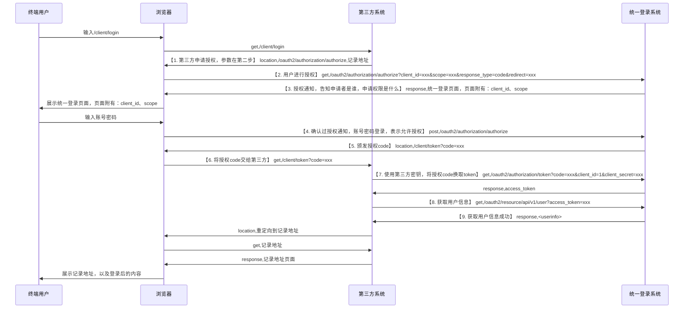

# 简介

这是一份面向开发人员的服务使用文档。

# 架构



# 约定

1. 通信协议：如果没有特殊说明，所有接口的通信协议默认是`HTTP/1.1`协议，标准是`rfc2616`。
2. 以下的接口信息是面向前端开发者、使用统一登录系统服务接口的智慧校园子系统开发者的，基于`http`协议的通信的请求和相应的信息。
3. url：所有接口都要在前面加上`http://<域名>`
4. 以下是示例接口：

- URL: `xxx`
- METHOD: `GET`
- REQUEST-HEADER:
```JSON
{
	'AUTHORIZATION':<str, "credential-type credentials">,
	'CONTENT-TYPE': <str, 发送数据类型,如："application/json"或"text/html">,
}
```
- REQUEST-PARAM:
```JSON
{
	'client_id':<str, client_id>,
	'username':<str, 用户名>,
	'password':<str, 密码>,
}
```
- RESPONSE-HEADER:
```JSON
{
	'LOCATION': <str, 重定向地址>,
	'WWW-Authenticate': <str, credentials>,
	'AUTHORIZATION':'<str, "credentials">',
}
```

- RESPONSE:
```JSON
{
	'errcode':<int, 错误代码，0则没有错误>,
	'errmessage': <str, 错误信息，一般可以直接展现给用户>,
	'entry': <{}, 返回的json数据>,
	'entries': <[{},], 返回的json数据列表>,
}
```


# 接口

# 统一登录系统服务接口


##### 用户登录-提交登录表单数据，获取code

- URL: `/oauth2/authorization/authorize`
- METHOD: `POST`
- REQUEST-PARAM:
```JSON
{
	'account':<str, 用户的账号>,
	'password':<str, 用户的密码>,

	# 下面的数据是不可修改的，是上一个接口带过来的，这里只是用来展示，作为开发时候比较直观。
	'client_id':<str, 第三方id，不可改>,
	'scope':<str, 第三方要获取的权限，如：snsapi_base。>,
	'response_type':<str, 返回类型，如：code>,
	'redirect_uri':'<str, 重定向地址，如：http://example.com/code_callback>'
}
```

- 备注，redirect_uri为client的接口，这个接口要处理code，所以重定向时，统一登录服务器会带上一个code参数，如：http://example.com/code_callback?code=xxx


###### (1). 返回成功

- 备注：请求成功时，会重定向到第三方接口，如重定向到这里：[用户登录-code换token](#用户登录-code换token)

- RESPONSE-HEADER:
```JSON
{
	'LOCATION': <str, 重定向回子系统服务器, 也就是上面的参数redirect_uri，如"/client/code_callback?code=xxx"，以及下面的地址>,
}
```


###### (2). 返回失败

- RESPONSE-HTML

- 备注：会跳转回当前[用户登录-提交登录表单数据，获取code](#用户登录-提交登录表单数据，获取code)页面，然后刷新错误信息，不用第三方处理。


##### 用户登录-获取token接口

- URL: `/oauth2/authorization/token`
- METHOD: `POST`
- REQUEST-PARAM:
```JSON
{
	'code':<str, 上一个接口重定向返回给第三方时，时在url所携带的code>,
	'client_id':<str, 第三方id>,
	'client_secret':<str, 第三方密钥>,
	`grant_type`:`<str, 授权模式，有四种，但只实现了授权码模式，所以只需要写死authorization_code>`
}
```
- RESPONSE-HEADER:
```JSON
{
	'errcode': <int, 错误代码>,
	'access_token': <str, 这个token就是最终需要的东西,然后使用该token去调用统一登录系统服务的接口>,
	'refresh_token': <str, 用于更新access_token的token>,
	'access_token_expires_in': <int, access_token有效时长，单位是秒>,
	'refresh_token_expires_in' <int, refresh_token有效时长，单位是秒>,
}
```

##### 用户登录-获取token接口

- URL: `/oauth2/resource/api/v1/user`
- METHOD: `GET`
- REQUEST-PARAM:
```JSON
{
	'user_access_token':<str, 填写上面那个接口的access_token>,

}
```
- RESPONSE-HEADER:
```JSON
{
	'errcode': <int, 错误代码>,
	'entry':{
		'account': <str, 用户账号，获取到用户账号后，可以在第三方服务做数据关系，存储用户其他相关数据>,
		'username': <str, 用户名>,
	}
}
```


# 第三方服务接口

##### 用户登录-获取第三方服务登录页面

- URL: `/client/login`
- METHOD: `GET`
- REQUEST-HEADER:
```JSON
{
	'CONTENT-TYPE': <str, 发送数据类型,如："text/html">,
}
```
- RESPONSE-HEADER:
```JSON
{
	'LOCATION': <str, 重定向到下面的地址>,
}
```
- 备注：重定向到这里：[用户登录-获取统一登录系统服务登录页面](#用户登录-获取统一登录系统服务登录页面)


##### 用户登录-code回调接口

- URL: `/client/code_callback`
- METHOD: `GET`
- REQUEST-PARAM:
```JSON
{
	'code': <str, 用于换取token的code>,
}
```
- RESPONSE-HEADER:
```JSON
{
	'LOCATION': <str, 重定向到登录之前的地址，如果没有，则重定向到默认地址，一般是该系统的首页>,
}
```
